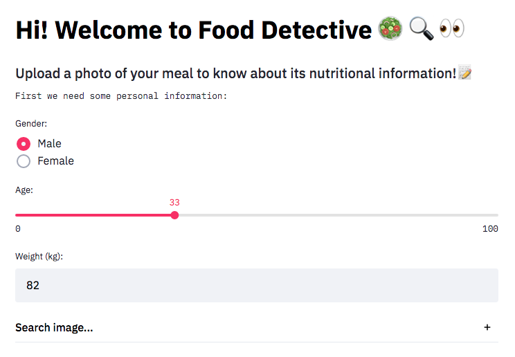
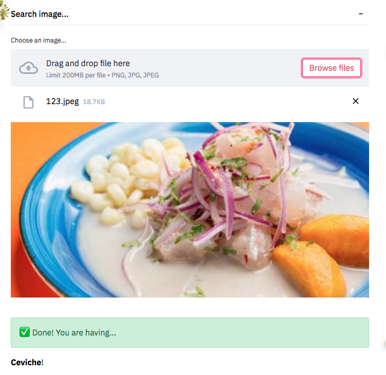
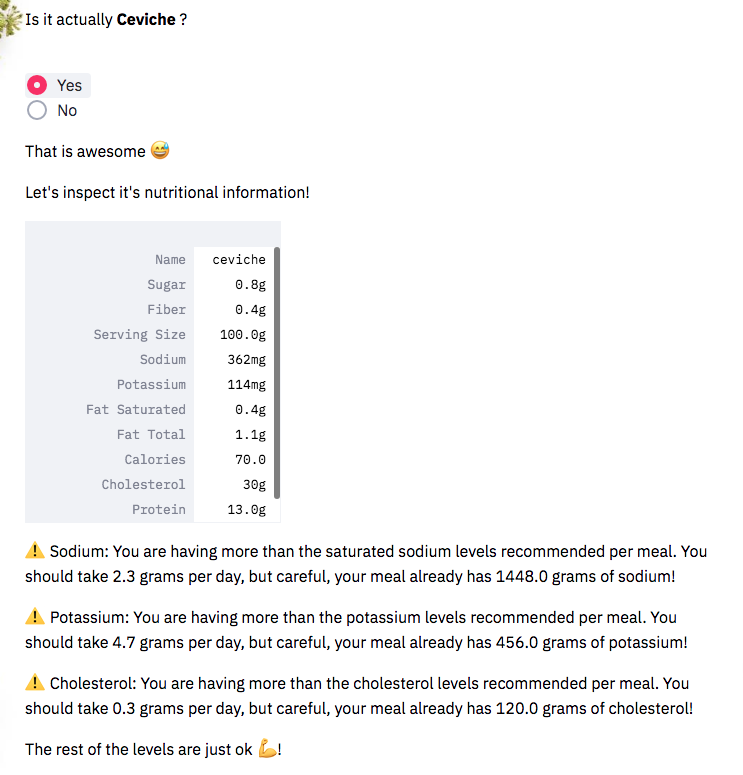

# Food Detective :green_salad: :mag: :eyes:

Food Detective is an app that recognizes the food on your dish and provides its nutritional information along with warnings about the daily intake of each nutrient present in the food.

## Demo :rocket:

You can check it out here :point_right: https://the-food-detective.herokuapp.com/

## Site
### Landing page

### Complete your personal information

### Upload an image of your meal

### Get its nutritional information

## Technologies
Project was created with: 
* Python version:  
* Heroku
* Streamlit

