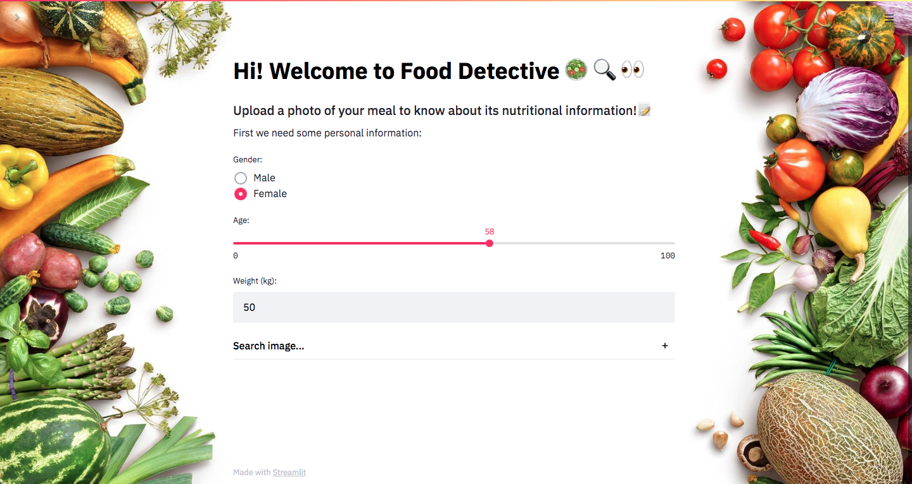

# Food Detective :green_salad: :mag: :eyes:
 
 An app that recognizes the food on your dish and provides its nutritional information along with warnings about the daily intake of each nutrient present in the food.

## Table of contents
* [General info](#general-info)
* [Demo](#demo)
* [Technologies](#technologies)
* [Project description](#project-description)
* [Site](#site)

## General Info

This project was made to present as the Final Project of the LeWagon's DataScience Bootcamp (Batch 561). 
Its purpose remains on bringing together all the components learnt during the bootcamp on a real open-ended problem.

:green_salad: :yum: Did you ever wanted to know how healthy is the food you are about to eat? 

:sleepy:  Did you quickly resign on the idea after realizing it takes a lot of time?

This is what we asked ourselves, and we came up with this idea! :bulb:

How about you upload an image of what you are about to eat and get its nutritional information immediatly? 
Great idea right? 
Let's checkout how we solved it! :rocket:

## Demo

You can check it out here :point_right: https://the-food-detective.herokuapp.com/

## Technologies
Project was created with: 
* Python version:  
* Kaggle Dataset Food 101
* Calorie Ninjas API
* Heroku
* Streamlit

## Project description

### Data source

To carry out the project we used the Kaggle's dataset Food 101. It contains 1000 images of 101 different food categories, giving a total of 100 000 images. 

The images were presented in different ways:

* All together in different folders according to their food category 
* .h5 files of different image sizes

One of the project's objectives was to link the food in the image with its nutritional information.

Therefore we used the API Calorie Ninjas, that contains free nutrition data for 100,000+ foods and beverages.

### Models trained

We started using different pretrained models such as **VGG16, Mobilenet, DenseNet, Resnet50** and **EfficientNet**.
Eventhough we modified them in order to get higher accuracies, we weren't so lucky because we still had low accuracy rates, between 20% and 39%.

We decided then to try **Google Cloud AutoML Vision**, a Google Cloud's tool that allows you to derive insights from object detection and image classification, in the cloud or at the edge. 

We uploaded the entire dataset to Google Cloud Storage, listed the images and their labels, and trained an AutoML Vision Edge model. 

After a few hours we obtained a model that predicted with **91.7%** accuracy. Impressive right? 🤯
Here we have some of the results obtained. 

### Confusion matrix 

### Precision

### Building the app

In order to let anyone use this application, we decided to deploy it in Heroku, a cloud Platform As a Service that allows us to develop, run, and manage the application without the complexity of building and maintaining the infrastructure typically associated with developing and launching an app.

### Visualisation 

To visualize the app we used Streamlit, a framework that allows us to turn the data scripts into a shareable web app. 

## Site
### Landing page

### Complete your personal information

### Upload an image of your meal

### Get its nutritional information

### Team

  |   |   | 
---|---
[Daniel Cañadas ](https://github.com/dani) |[Julieta Hocsman](https://github.com/julietahocsman/) |[Santiago Caride](https://github.com/carmaiquel/) |[Tomas Altilio](https://github.com/tomasaltilio/)
